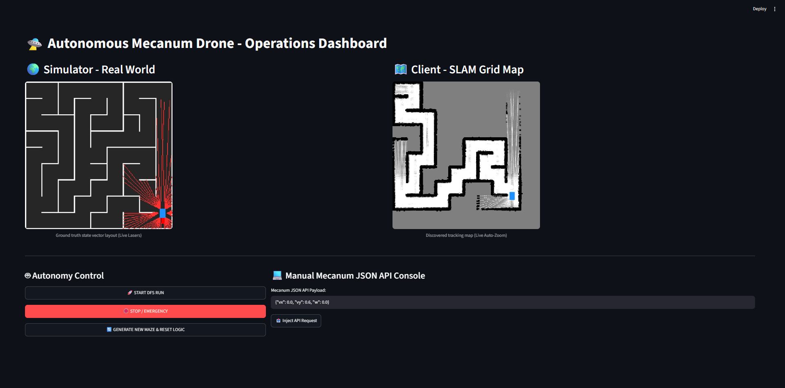

# 🛸 Autonomous Mecanum Drone - Control Panel & SLAM Simulator

A comprehensive system for drone control, spatial mapping (SLAM), and autonomous maze exploration (DFS) designed for a Mecanum-wheeled chassis driven by an ESP32-S3 microcontroller. The project features an asynchronous physics server, a decision-making client, and a web-based human-machine interface (HMI) accessible directly via any web browser.

---

## 📸 Dashboard Preview
Below is a live look at the operational dashboard during automated maze solving and SLAM mapping.



---

## 📑 Table of Contents
1. [Quick Start (How to run the program)](#1-quick-start-how-to-run-the-program)
2. [Security & Environment Variables (`.env`)](#2-security--environment-variables-env)
3. [System Architecture](#3-system-architecture)
4. [Environment and Robot Configuration (`config.py`)](#4-environment-and-robot-configuration-configpy)
5. [Guidelines for the CAD Team (Sensors & Dimensions)](#5-guidelines-for-the-cad-team-sensors--dimensions)
6. [Safety Model and API Kinematics](#6-safety-model-and-api-kinematics)

---

## 1. Quick Start (How to run the program)

### System Requirements
Make sure you have Python 3.10 or newer installed along with the required packages:

```bash
pip install streamlit streamlit-autorefresh numpy opencv-python websockets matplotlib python-dotenv

```

### Launching the Application

All system modules (Physics Server, Network Client, and the Web Dashboard) are automatically coordinated by a central startup script. Simply execute the following command in your terminal:

```bash
python init.py

```

**What happens next?**

1. The headless physics server (`main.py`) launches in the background on port `8765`.
2. The client thread (`client.py`) initializes to run the SLAM and DFS algorithms.
3. Your web browser will automatically open the control panel at: **`http://localhost:8501`**.

---

## 2. Security & Environment Variables (`.env`)

To protect production cryptographic keys and prevent sensitive credential leaks on GitHub, the system utilizes an environment isolation pattern.

### Setup Instructions:

1. Locate the `.env.example` file in the root directory.
2. Clone or rename this file to exactly **`.env`** (this file is pre-configured in `.gitignore` and will never be tracked by Git).
3. Open `.env` and configure your secret HMAC authentication key:

```env
ROBOT_HMAC_KEY=your_secret_hex_key_here

```

*Note: Both `main.py` and `client.py` read this variable runtime safely using `python-dotenv`. If no `.env` file is present, the codebase automatically falls back to a development safety key.*

---

## 3. System Architecture

The application is engineered using a multi-threaded architecture driven by asynchronous network communication, effectively eliminating control delays (*latency*):

* **`main.py` (Server / Real World):** Responsible for simulating the drone's physics, checking rectangle hitbox collisions, and mathematically calculating the laser sensor ray distances relative to the maze walls.
* **`client.py` (Brain / Explorer):** Consumes telemetry data from the server. It builds a probabilistic occupancy grid map (SLAM), filters out sensor noise, and schedules the next steps for the Depth-First Search (DFS) algorithm. It includes a built-in **Stall Detector**, which flags a roadblock, marks a virtual wall, and backtracks from the DFS path stack if the drone fails to physically move for 20 frames.
* **`dashboard.py` (HMI / Web Interface):** A modern Streamlit control panel. It displays two independent side-by-side windows with fixed dimensions (450x450px): the simulator's ground truth with live sensor rays, and a dynamic Auto-Zoom view of the SLAM map. It allows operators to trigger the randomized track regenerations (**"🔄 GENERATE NEW MAZE & RESET LOGIC"**), start the DFS solver, and inject manual API payloads.
* **`config.py` (Configuration):** The sole, centralized configuration file housing all mechanical and sensor parameters for the robot.

---

## 4. Environment and Robot Configuration (`config.py`)

To modify key parameters easily without digging into the underlying algorithmic code, adjust the constants directly inside `config.py`.

### Changing Maze Dimensions:

```python
N, M = 9, 9       # Maze dimensions (rows, columns)
CELL_SIZE = 30    # Size of a single grid cell in pixels/cm
WALL_THICK = 2    # Thickness of the maze walls

```

### Changing Drone Dimensions:

```python
ROBOT_W_WIDTH = 10.0   # Physical drone width (lateral axis / Strafe)
ROBOT_L_LENGTH = 16.0  # Physical drone length (longitudinal axis / Forward-Back)

```

---

## 5. Guidelines for the CAD Team (Sensors & Dimensions)

For the mechanical engineering team handling CAD layout and 3D printing, the distance sensor section in `config.py` is of paramount importance. **The number of sensors and their angular placements in the software configuration must mirror the physical hardware mounting on the drone's frame exactly.**

### How to Modify the Number of Sensors and Their Layout

Locate these variables inside `config.py`:

```python
NUM_SENSORS = 6  # Change this value to increase/decrease the sensor count
SENSOR_ANGLES_DEG = [0, 60, 120, 180, 240, 300]  # Sensor mounting angles on the drone

```

#### Instructions for the CAD Engineer:

1. **`NUM_SENSORS`**: Defines how many physical distance modules (e.g., ToF - Time of Flight sensors like the VL53L1X) are installed on the platform.
2. **`SENSOR_ANGLES_DEG`**: An array of angles (in degrees) mapping where each sensor points. The drone's coordinate frame defines `0°` as the **right side of the drone (Strafe_Right axis)**. Angles increase **clockwise**.

#### Reconfiguration Examples for the CAD Team:

* **Standard Hexagonal Layout (6 sensors distributed evenly every 60°):**
```python
NUM_SENSORS = 6
SENSOR_ANGLES_DEG = [0, 60, 120, 180, 240, 300]

```


* **Cross Layout (4 sensors aligned to major axes: Front, Back, Left, Right):**
If CAD positions the sensors strictly on the drone's centerlines, match it using:
```python
NUM_SENSORS = 4
SENSOR_ANGLES_DEG = [0, 90, 180, 270] 
# 0° = Right, 90° = Front, 180° = Left, 270° = Back

```


---

## 6. Safety Model and API Kinematics

The implemented control loops are 100% compliant with the official ESP32-S3 firmware specifications for the Mecanum hardware platform.

### 1. Preventing Motor Stalls (Start Floor / Min Duty)

Per the physical robot's technical spec sheet:

> *Geared motors stall at low PWM. Any wheel that should move gets at least this duty. So 0.1 and 0.5 may look the same on a bench. Default: 0.55.*

Our exploration algorithm commands a linear travel velocity threshold of **`0.60`**. This ensures the system reliably overrides gearbox inertia and drives the drone on high-friction tournament tracks, eliminating motor lockups.

### 2. Coordinate System Alignment (Level 2 Kinematics)

All manual JSON console commands and automated explorer instructions observe the following vehicle mixer constraints:

* `vy` = Controls **Forward / Back** travel (longitudinal movement)
* `vx` = Controls **Strafe** travel (slide sideways / lateral movement)
* `w`  = Controls in-place rotational speed (**Yaw / Rotate**) - positive values spin the vehicle clockwise.

Example of a valid motion request:

```json
{"vx": 0.0, "vy": 0.6, "w": 0.0}

```

```
